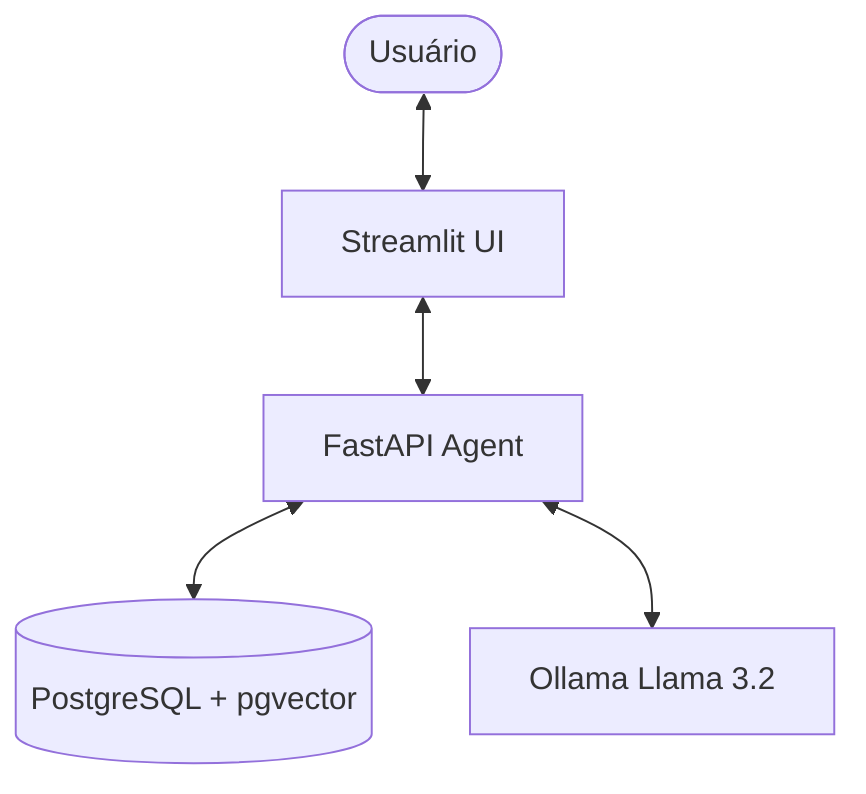
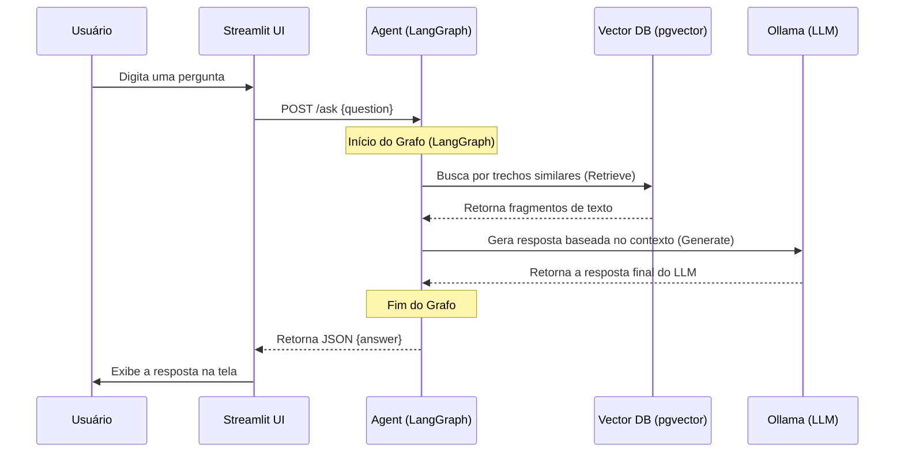

# RAG Agent Pro 🚀

Este projeto é um agente de **Retrieval-Augmented Generation (RAG)** construído com **LangGraph**, **LangChain**, e **Ollama**. O agente permite que os usuários façam o upload de documentos PDF, os indexem em um banco de dados vetorial **pgvector**, e realizem perguntas cujas respostas são baseadas exclusivamente no conteúdo desses documentos.

---

## 🏗️ Arquitetura

O sistema é composto por quatro serviços principais orquestrados via Docker:

1.  **UI (Streamlit)**: Interface de chat e upload de arquivos.
2.  **Agent (FastAPI + LangGraph)**: O cérebro do sistema, que coordena o fluxo de consulta (recuperação e geração).
3.  **Vector DB (PostgreSQL + pgvector)**: Armazenamento vetorial para busca semântica de fragmentos de documentos.
4.  **LLM/Embeddings (Ollama)**: Motor de inferência local que executa o modelo Llama 3.2 para geração de texto e embeddings.

### Diagrama de Blocos



---

## 🔄 Fluxo de Funcionamento (Diagrama de Sequência)

O diagrama abaixo ilustra o processamento de uma pergunta pelo agente:



---

## 🛠️ Tecnologias Utilizadas

-   **Backend**: Python, FastAPI, LangGraph.
-   **LangChain**: Gerenciamento de cadeias, prompts e integrações de LLM.
-   **Banco de Dados**: PostgreSQL com a extensão `pgvector`.
-   **LLM Local**: Ollama (Rodando o modelo `llama3.2`).
-   **Frontend**: Streamlit.
-   **Infraestrutura**: Docker & Docker Compose.

---

## 🚀 Como Rodar Localmente (Docker)

### Pré-requisitos

-   [Docker](https://docs.docker.com/get-docker/) instalado.
-   [Docker Compose](https://docs.docker.com/compose/install/) instalado.

### Passo a Passo

1.  **Clonar o repositório**:
    ```bash
    git clone <url-do-repositorio>
    cd agente-rag-langgraph
    ```

2.  **Configurar variáveis de ambiente** (opcional):
    O sistema já vem com valores padrão, mas você pode criar um arquivo `.env` baseado no `.env.example` se desejar customizar senhas ou portas.

3.  **Subir os serviços**:
    ```bash
    docker compose up --build
    ```

    > [!IMPORTANT]
    > Na primeira execução, o serviço do Ollama irá baixar o modelo `llama3.2` (aprox. 2GB). O agente aguardará o download ser concluído para ficar disponível (`healthcheck`).

4.  **Acessar as interfaces**:
    -   **Interface do Chat (UI)**: [http://localhost:8501](http://localhost:8501)
    -   **Documentação da API**: [http://localhost:8000/docs](http://localhost:8000/docs)

---

## 📂 Funcionalidades

-   **Upload de PDF**: Processa e indexa documentos automaticamente.
-   **Busca Semântica**: Recupera apenas as partes relevantes dos documentos.
-   **Privacidade**: Tudo roda localmente via Docker e Ollama, sem envio de dados para APIs externas.
-   **Interface intuitiva**: Experiência de chat moderna via Streamlit.
